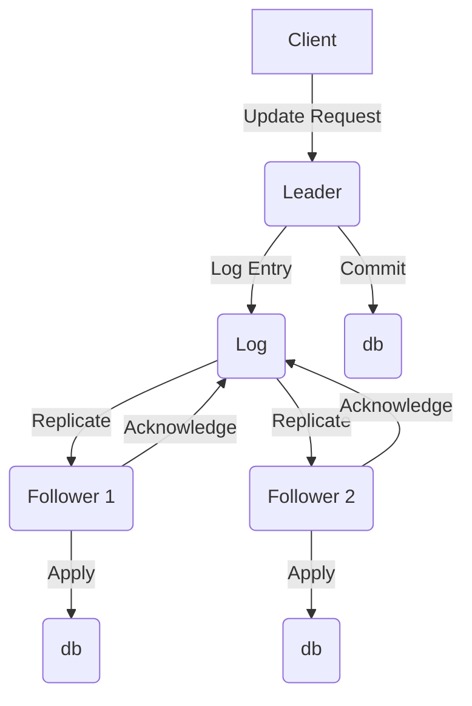
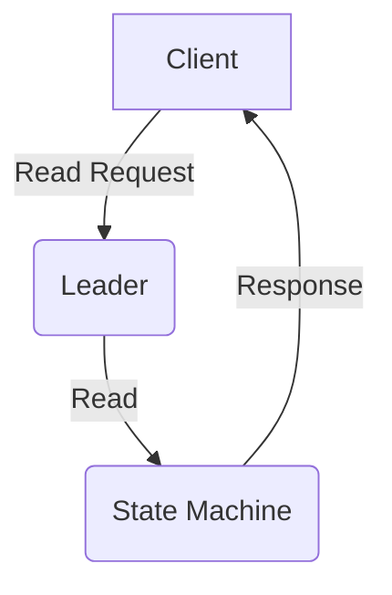
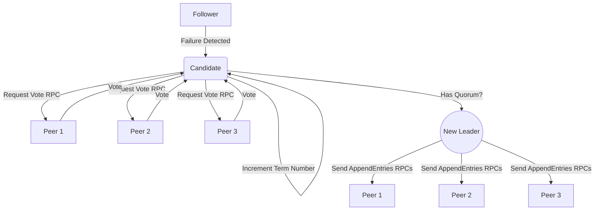

# ETCD
etcd is an open source distributed key-value store used for storing and retrieving configuration data, metadata, and state information of a system. It was developed by CoreOS and is now maintained by the Cloud Native Computing Foundation (CNCF).

etcd provides a highly available and consistent way to store and manage data across a distributed system. It uses the Raft consensus algorithm to ensure that data is replicated and consistent across multiple nodes in a cluster. This makes it ideal for use in cloud-native applications and microservices architectures. It is used by OpenShift to store configuration data for the various components of the platform. It serves as a central repository for storing and managing the state of the entire cluster.

# Distributed Consensus / RAFT

Distributed consensus is the process of reaching an agreement among a group of distributed nodes on a single value or decision, even in the presence of failures or network delays. This is a crucial problem in distributed systems, where multiple nodes need to coordinate and agree on a shared state or decision.

Etcd maintains consensus through the Raft consensus algorithm, which is a widely-used algorithm for distributed consensus. Raft is designed to be easy to understand and implement, and provides strong guarantees of consistency and availability in the presence of failures.

In Raft, each node in the etcd cluster is either a leader, a follower, or a candidate. The leader is responsible for coordinating updates to the database, while followers and candidates participate in the consensus protocol by voting on the leader and propagating updates.

To maintain consensus, Raft uses a series of leader elections and heartbeats to ensure that all nodes agree on the current leader. The leader is responsible for managing updates to the database, and followers and candidates must acknowledge the leader's authority before accepting updates.

When a client makes a change to the database, the leader receives the update and broadcasts it to all followers and candidates. Once a quorum of nodes (i.e., a majority) has acknowledged the update, it is committed to the database and propagated to all nodes in the cluster.

If a node fails or becomes disconnected, Raft uses a series of timeouts and retries to detect the failure and elect a new leader. Once a new leader is elected, the consensus protocol resumes and updates can continue to be made to the database.

Learn more about RAFT [here](https://raft.github.io/).

# 'snapshot' and 'db' Files
The snapshot and db files in etcd are both used to store the state of the etcd database, but they serve slightly different purposes.

The snapshot file contains a point-in-time representation of the etcd database. It includes the current state of the database at the time the snapshot was taken, as well as a snapshot of the transaction log. This file is used for backup and disaster recovery purposes, as it can be used to restore the etcd database to a previous state in the event of a failure.

On the other hand, the db file is the persistent storage used by etcd to store the current state of the database. It is a key-value store that stores all of the data that is currently being managed by etcd. This file is constantly updated as changes are made to the database.

The snapshot file is typically larger than the db file because it contains a complete copy of the etcd database. The db file, on the other hand, only contains the current state of the database.

In general, the snapshot and db files are both important components of the etcd database. The snapshot file is critical for disaster recovery purposes, while the db file is necessary for the ongoing operation of the etcd database.

# How does etcd commit to the db?
Etcd uses the Raft consensus algorithm to ensure that updates are committed to the database in a consistent and fault-tolerant manner. When a client makes a change to the database, the following steps occur to decide whether to commit the change:

1. The client sends a request to the leader node in the etcd cluster.
2. The leader appends the new entry to its log and sends the entry to its followers.
3. The followers acknowledge the receipt of the entry and update their logs accordingly.
4. Once the leader has received acknowledgments from a majority of the followers, it considers the entry to be committed and applies it to its state machine. It then informs its followers that the entry has been committed, and they apply it to their state machines as well.

In Raft, a log entry is considered committed when it has been written to the leader's log and the logs of a majority of the followers. This ensures that the entry will be available even in the event of node failures or network partitions.

Once an entry has been committed, it is applied to the state machine, which is a deterministic finite automaton that represents the current state of the etcd database. Applying the entry to the state machine ensures that the change is reflected in the database, and that all nodes in the etcd cluster have a consistent view of the system.

# How does etcd read from the db when a client makes a read request?

In the read process, a client sends a read request to the leader node, which reads the current state of the system from the state machine and sends the response back to the client.

The main difference between the commit and read processes is that the commit process involves updating the state machine, while the read process only involves reading from the state machine. In the commit process, the Raft consensus algorithm is used to ensure that all nodes in the etcd cluster have a consistent view of the system and that updates are committed in a fault-tolerant manner. In the read process, no consensus protocol is needed because the state machine represents the current state of the system, and there is no need to replicate or commit any updates.

# Leader Elections

In etcd, leader elections are triggered when the current leader fails or becomes disconnected from the cluster. The leader election process is based on the Raft consensus algorithm, which ensures that a new leader is elected in a way that is consistent with the current state of the system.

When a follower node detects that the leader has failed or become disconnected, it starts a new leader election. The node becomes a candidate and requests votes from the other nodes in the cluster. If the candidate receives votes from a quorum of nodes, it becomes the new leader.

The leader election process is divided into several phases, as follows:

- Initiation: When a follower node detects that the current leader has failed or become disconnected, it starts a new leader election by incrementing its current term number and becoming a candidate.

- Request Votes: The candidate sends a RequestVote RPC to all other nodes in the cluster, asking for their vote to become the new leader. The RPC contains the candidate's term number, its ID, and the index and term number of the last log entry it has seen.

- Voting: When a follower node receives a RequestVote RPC, it checks its own term number. If the candidate's term number is greater than its own, it updates its term number and votes for the candidate. Otherwise, it rejects the vote. A follower node can only vote for one candidate per term.

- Election Results: If a candidate receives votes from a quorum of nodes, it becomes the new leader. It sends AppendEntries RPCs to all other nodes in the cluster to replicate any missing log entries and update their state machines.

If no candidate receives votes from a quorum of nodes, the election process starts over with a new term number.

# Quorum
Quorum refers to the minimum number of nodes that must agree on a decision before it can be considered valid and committed to the database. Specifically, a quorum is defined as the majority of the nodes in the cluster, which is calculated as (N/2)+1, where N is the total number of nodes in the cluster. The resiliency of a cluster is the number of nodes that can be lost before the cluster loses quorum. This is calculated as (n-1)/2.

For example, if a cluster has five nodes, the quorum would be three, because three is the smallest number of nodes that constitutes a majority. In this case, a decision would only be considered valid if it receives votes from at least three nodes.

The use of a quorum in the Raft consensus algorithm ensures that decisions are only made when there is agreement among a majority of the nodes in the cluster, which helps to prevent inconsistencies and ensures that all nodes have a consistent view of the state of the system. Additionally, it allows the system to continue operating even if some nodes fail or become disconnected, as long as a quorum of nodes remains available.

# Does adding additional nodes to an etcd cluster inprove performance?
While etcd is designed to be a scalable and distributed key-value store, running etcd clusters with a large number of peers can introduce some downsides and challenges. Here are a few potential issues to consider:

- Increased network complexity: As the number of etcd peers increases, so does the complexity of the network topology. Each additional peer adds more connections and potential points of failure, which can make it more difficult to troubleshoot network issues.

- Higher resource requirements: Running a large etcd cluster can require significant computing resources, particularly memory and CPU. In order to maintain good performance and reliability, each node in the cluster should have enough resources to handle the load.

- Slower write performance: With a larger number of peers, the consensus protocol used by etcd to ensure consistency and availability can become slower. This is because each write operation must be replicated across all nodes in the cluster, and as the number of nodes increases, the time required for consensus can increase.

- Increased risk of split-brain: In a large etcd cluster, the risk of split-brain (where different nodes in the cluster have different views of the state) can be higher. This can occur if network partitions or other issues cause nodes to become disconnected from each other. If this happens, it can be difficult to recover a consistent state without manual intervention.

Overall, while it is possible to run etcd clusters with a large number of peers, doing so requires careful consideration of the potential downsides and trade-offs. It is important to ensure that the cluster is properly configured, monitored, and maintained in order to ensure reliable and consistent operation. Openshift has choosen 3 peers as the optimal tradeoff between performance and resilience. 
